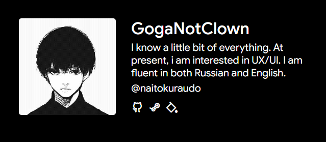

# GogaNotClownProfile [RU](README_RU.md) [Link to website](https://goganotclownprofile.netlify.app/)

My personal website, developed with VueJS3 + ViteJS, that use GitHub REST API to fetch data dynamically



## Table of Contents

- [Installation](#installation)
- [Mini-guide](#mini-guide)
- [Directory Structure](#directory-structure)
- [Technologies Used](#technologies-used)
- [Contact](#contact)
- [Project Status](#project-status)

## Installation

To use this project, follow these steps:

1. **Clone the Repository:**
   Ensure that Git is installed on your system.
   ```bash
   git clone https://github.com/GogaNotClown/GogaNotClownProfile.git
   cd GogaNotClownProfile
   ```

2. **Download NPM packages:**
   Ensure that Node.js is installed on your system.
   ```bash
   npm install
   ```

3. **Run Project:**
   This command will run the project on localhost.
   ```bash
   npm run dev
   ```

## Mini-guide

[How to get your GitHub token](https://docs.github.com/en/authentication/keeping-your-account-and-data-secure/managing-your-personal-access-tokens)

## Directory Structure

| Name               | Description                    |
|--------------------|--------------------------------|
| **public/**        | Static assets (assets, fonts). |
| **src/**           | Source files.                  |
| **src/components** | Vue components.                |

## Technologies Used

- HTML
- CSS
- [VueJS3](https://vuejs.org/)
- [ViteJS](https://vitejs.dev/)

## Contact

For questions or suggestions, you can contact [GogaNotClown](https://github.com/GogaNotClown/) via GitHub

## Project Status

Supported
